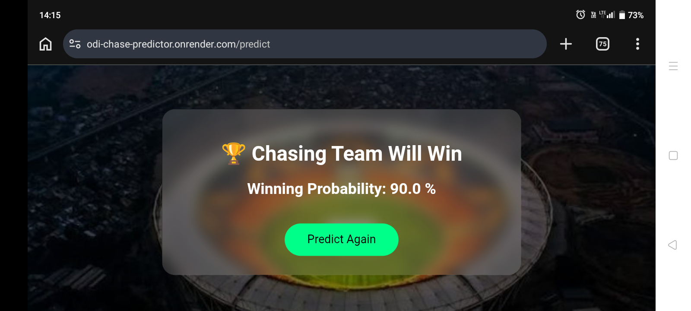
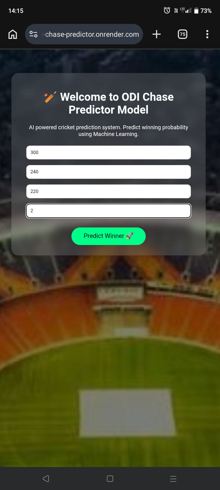
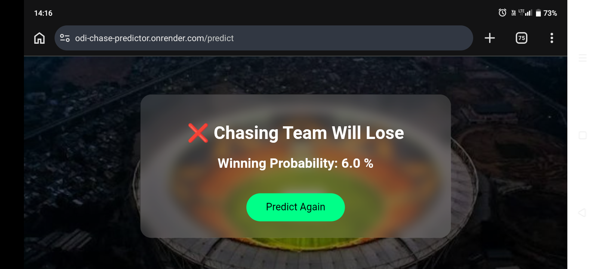

# ODI-CHASE-PREDICTOR
## A machine learning model which predicts wether chasing is possible or not. which is trained by RandomForestClassifier
# WEBSITE:
[chase predictor website](https://odi-chase-predictor.onrender.com/)
# Libraries
- python
- numpy
- pandas
- matplotlib
- seaborn
- scikit-learn
- joblib
- flask
# Sources
- kaggle (source of data)
- pydroid3 (model creation)
- github (to deploy)
- render (deployment)
- chatgpt (coding assistant)
# Performance of model 
- RandomForestClassifier - 1.00
- DecisionTreeClassifier - 0.96
- LogisticRegression     - 0.90

# Skills improved 
- pandas
- scikit-learn
- organised coding
- dumping model
- deployment of model

# Challenges
- feature engeneering
- deployment
## Screenshots

### Home Page

### Prediction Page

### Result Page

### Dashboard

### Mobile View

